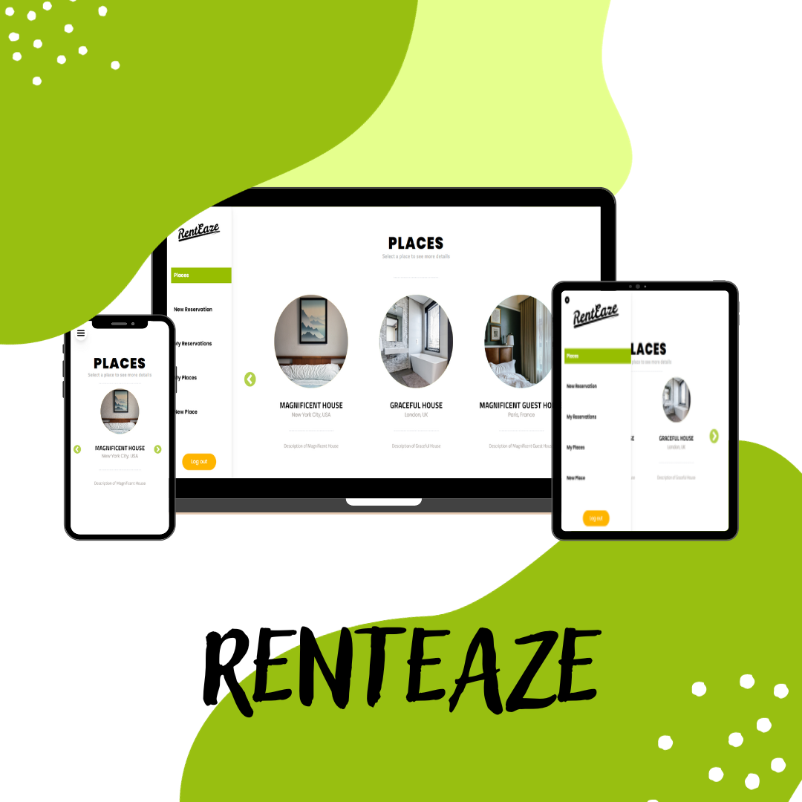

<div align="center">



<a name="readme-top"></a>

  <h3><b>final_capstone_front_end</b></h3>

</div>

# 📗 Table of Contents

- [📗 Table of Contents](#-table-of-contents)
- [📖 Final Capstone Front End ](#-final-capstone-front-end-)
  - [🛠 ER Diagram ](#-er-diagram-)
  - [💻 Link to Back End ](#-link-to-back-end-)
  - [💻 link to Kanban board information ](#-link-to-kanban-board-information-)
  - [🛠 Built With ](#-built-with-)
    - [Tech Stack ](#tech-stack-)
    - [Key Features ](#key-features-)
  - [💻 Getting Started ](#-getting-started-)
    - [Prerequisites](#prerequisites)
    - [Setup](#setup)
    - [Install](#install)
    - [Usage](#usage)
    - [Run tests](#run-tests)
  - [👥 Authors ](#-authors-)
  - [🔭 Future Features ](#-future-features-)
  - [🤝 Contributing ](#-contributing-)
  - [⭐️ Show your support ](#️-show-your-support-)
  - [🙏 Acknowledgments ](#-acknowledgments-)
  - [❓ FAQ (OPTIONAL) ](#-faq-optional-)
  - [📝 License ](#-license-)
# 📖 Final Capstone Front End <a name="about-project"></a>

**Final Capstone Front End** The front-end component of this final capstone project is developed using React.js, designed to provide an intuitive user interface for managing creation of places to rent and make reservations for those places. It communicates with the back-end API built with Ruby on Rails.

## 💻 Link to Back End <a name="link-to-back-end"></a>

[Link to Back End](https://github.com/grauJavier/final-capstone-back-end)

<p align="right"\><a href="#readme-top"\>back to top\</a></p>

## 💻 link to Kanban board information <a name="built-with"></a>

[Link to Kanban Board](https://github.com/grauJavier/final-capstone-back-end/projects/1)

[Initial state](https://github.com/grauJavier/final-capstone-front-end/issues/38)

This project was completed by three Team members:

- Javier Grau
- Manuel Sanchez
- Anthony Vásquez

<p align="right">(<a href="#readme-top">back to top</a>)</p>

## 🛠 Built With <a name="built-with"></a>

### Tech Stack <a name="tech-stack"></a>

<details>
  <summary>Technologies</summary>
  <ul>
    <li><a href="https://reactjs.org/">React.js</a></li>
  </ul>
</details>

### Key Features <a name="key-features"></a>

- **React.js Components**
- **API Communication with Backend**
- **User-Friendly Interface**
- **Responsive Design**
- **State Management**

<p align="right"\><a href="#readme-top"\>back to top\</a></p>

## 💻 Getting Started <a name="getting-started"></a>

To get a local copy up and running, follow these steps.

### Prerequisites

Before you begin, make sure you have the following prerequisites installed on your system:

- Node.js: You need Node.js to run the React.js application.
- npm: npm is used to manage packages in your React project.

### Setup

Clone this repository to your desired folder:

sh <br>
cd my-folder <br>
git clone git@github.com:grauJavier/final-capstone-front-end.git

### Install

Install this project with:

- npm install

### Usage

To run the project, execute the following command:

npm start

### Run tests <a name="tests"></a>
To run the frontend tests, follow these steps:

### Prerequisites

Before running the tests, ensure you have the following installed:

- Node.js: You need Node.js to execute the test scripts.
- npm: npm is used to manage packages in your React project.

Additionally, make sure you have installed the following testing extensions:

- jest-fetch-mock: Used for mocking fetch requests.
- redux-mock-store: Used for mocking Redux store.
- redux-thunk: Used for testing Redux thunks.

### Running Tests

Execute the following command to run the tests:

```bash
npm run test
```
This command will run the test suites and provide you with the test results and coverage information.


<p align="right"><a href="#readme-top">back to top</a></p>

## 👥 Authors <a name="authors"></a>

👤 **Javier Grau**

- GitHub: [@grauJavier](https://github.com/grauJavier)

👤 **Manuel Sanchez**

- GitHub: [@Luffytaro22](https://github.com/Luffytaro22)
- LinkedIn: [Manuel Sanchez](https://www.linkedin.com/in/manuel-alejandro-sanchez-sierra/)

👤 **lRebornsl**

- GitHub: [@lRebornsl](https://github.com/lRebornsl)
- Twitter: [@RebornsDev](https://twitter.com/RebornsDev)
- LinkedIn: [Anthony Vásquez](https://www.linkedin.com/in/avvm98/)

<p align="right"\><a href="#readme-top"\>back to top\</a></p>

## 🔭 Future Features <a name="future-features"></a>

- [ ] **User Authentication and Authorization**
- [ ] **Integration with External APIs for Car Information**
- [ ] **User Profile Management**

<p align="right"\><a href="#readme-top"\>back to top\</a></p>

## 🤝 Contributing <a name="contributing"></a>

Contributions, issues, and feature requests are welcome!

Feel free to check the [issues page](https://github.com/grauJavier/final-capstone-front-end/issues).

<p align="right"\><a href="#readme-top"\>back to top\</a></p>

## ⭐️ Show your support <a name="support"></a>

If you find this project helpful, feel free to contribute or give it a star. Your support is appreciated!

<p align="right"\><a href="#readme-top"\>back to top\</a></p>

## 🙏 Acknowledgments <a name="acknowledgments"></a>

- Behance and Murat Korkmaz for the [original design](https://www.behance.net/gallery/26425031/Vespa-Responsive-Redesign)
- Microverse for providing the opportunity to learn in a collaborative environment.
- React.js Documentation for valuable resources on React development.
- GitHub for version control and collaboration tools.

<p align="right"\><a href="#readme-top"\>back to top\</a></p>

## ❓ FAQ (OPTIONAL) <a name="faq"></a>

- **Can I use your project as a template for my own project?**

  - Certainly, feel free to use this project as a template for your own work.

- **Is your project licensed?**

  - Yes, this project is open-source and available under the MIT License. You can find more details about the license [here](./LICENSE).

<p align="right"\><a href="#readme-top"\>back to top\</a></p>

## 📝 License <a name="license"></a>

This project is licensed under the MIT License - you can click here to have more details [MIT](./LICENSE).

<p align="right"\><a href="#readme-top"\>back to top\</a></p>
